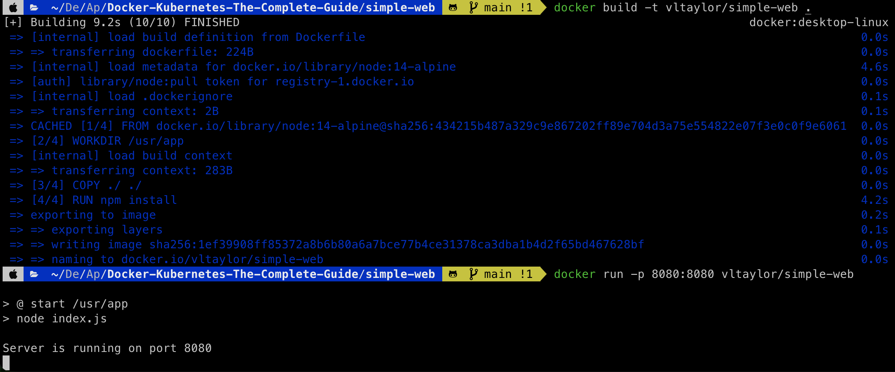
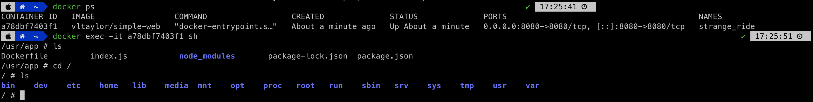
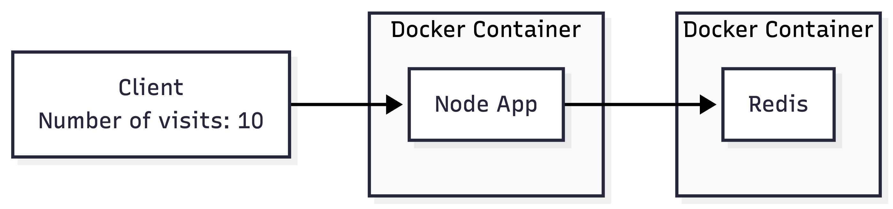
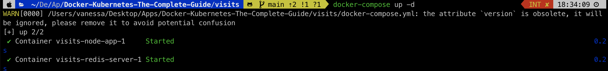
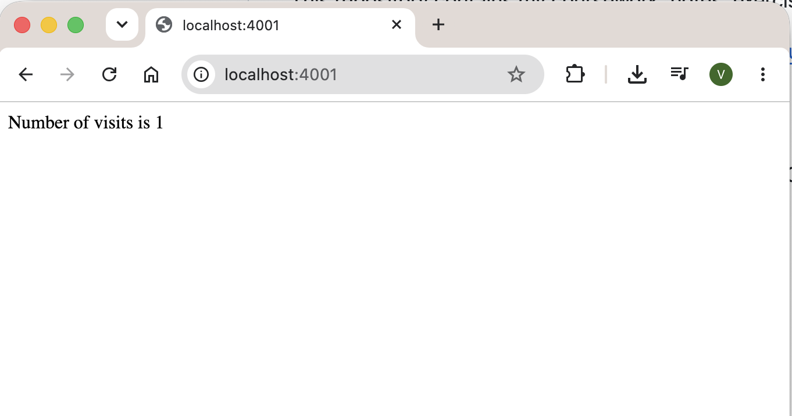
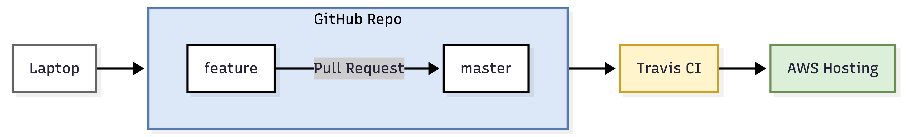
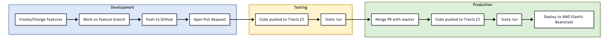

# Docker-Kubernetes-The-Complete-Guide

This repository contains my coursework, notes, exercises, and projects completed while studying:

- Course: [Docker and Kubernetes: The Complete Guide](https://www.udemy.com/share/101WjM3@e9IN8-R3buEAdALNOvZQURCtCAvgY1qBnW_Co5YNkmAni67O4-xYYcX7ym8SFexpFg==/)
- Instructor: Stephen Grider
- Platform: Udemy

The course covers containerization, orchestration, CI/CD pipelines, cloud deployments, and production-ready application workflows using Docker and Kubernetes.

### Technologies

- Docker
- Docker Compose
- Kubernetes
- Travis CI
- GitHub
- AWS
- Google Cloud Platform
- Node.js
- React
- Redis
- PostgreSQL
- Skaffold

## Projects

### Simple web

- Docker Port Forwarding

- Building and Running a Docker Container
  

- Docker Port Mapping Syntax: `docker run -p 8080:8080`

- Inspecting and Accessing a Running Container
  

- Create new database
  

### Visits Application

Objectives: Docker Compose with Multiple Local Containers

- docker containers
- images
- docker cli
- docker compose

Visits Application Architecture

<br />

Setup



#### Docker Compose

Launch Containers in Background

```bash
docker-compose up -d
```

Stop Containers

```bash
docker-compose down
```

<br/>
Container Exit Status Codes

| Status Code    | Meaning                                     |
| -------------- | ------------------------------------------- |
| `0`            | Container exited successfully.              |
| `1, 2, 3, ...` | Container exited because an error occurred. |

<br/>
Docker Restart Policies

| Policy           | Description                                                                                                         |
| ---------------- | ------------------------------------------------------------------------------------------------------------------- |
| `no`             | Never restart the container if it stops or crashes. _(Default)_                                                     |
| `always`         | Always attempt to restart the container whenever it stops, regardless of the reason.                                |
| `on-failure`     | Restart the container only if it exits with a non-zero (error) status code.                                         |
| `unless-stopped` | Always restart the container unless it was explicitly stopped by the user (`docker stop` or `docker-compose down`). |

### Flow

Objective: Production Grade Workflow Application



